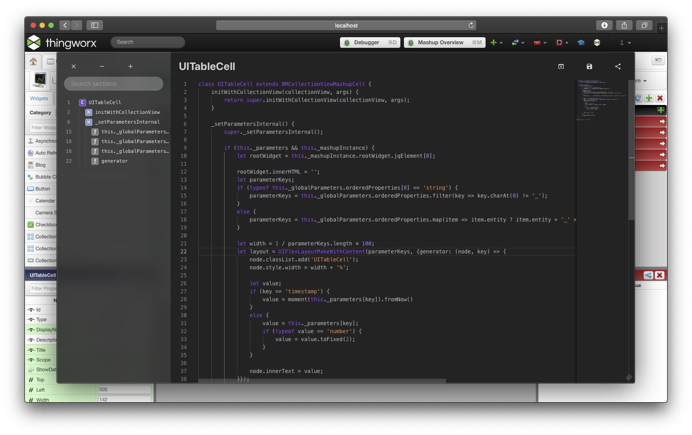

🛑 **Note: If you are planning to use this widget in Thingworx 8.5 or newer, strongly consider using [Core UI Widgets](https://github.com/ptc-iot-sharing/BMCoreUIWidgets) instead.** You may also use this + core ui if you have older projects where you were using core ui symbols from a globally scoped script which is no longer supported in core ui widgets.

This repository contains the standalone development version of the `BMCodeHost` widget and is the source from which the widget is merged into core ui widgets.

# Introduction

Requires [CoreUI](https://github.com/ptc-iot-sharing/BMCoreUI) and [monacoScriptEditor](https://github.com/ptc-iot-sharing/MonacoEditorTWX).

This extension allows developers to customize their mashups using custom CSS, Javascript or TypeScript code.



Although Thingworx contains two built-in Expression and Validator widgets that can be used by developers to write custom logic in Javascript, those widgets are extremely limited because the code typing area is quite small and many often used keywords are blocked. This makes those widgets inappropriate for anything beyond simple calculations or validations.

Instead, the `BMCodeHost` extension aims to make Javascript logic (and TypeScript) a first class citizen in Thingworx mashups. Beyond just providing a method to write custom Javascript code in the composer and execute it at runtime, it makes it very easy to actually integrate that code with the rest of the mashup environment by exposing easy to use properties, events and services.

## Basic Usage

To start adding custom logic to your mashup, add one of the two widgets to your mashup:
 - `Object`: Allows you to write logic in Javascript
 - `TypeScript Object`: Allows you to write logic in TypeScript
 - `Typescript Class`: Allows you to write logic in TypeScript by extending a widget class.

When you do so, the newly added widget will look like in the screenshot below; Click on the name of the object to open the editor.


The editor will provide a large area in which code can be written. Normally, this code is evaluated immediately after the object is created at runtime. You will notice that unlike the Expression, there is no `Evaluate` service to invoke and no `Output` to configure.

For the `Stylesheet` widget, the CSS that you type will be added to the document stylesheets as soon as the widget is loaded at runtime. Note that those stylesheets will be removed when the mashup containing it is unloaded. If you want your CSS to be retained, consider placing the `Stylesheet` widget in your mashup's master.

## Interacting with the Mashup

### Object and TypeScript Object

To interact with the Mashup and other widgets, the `Object` and `TypeScript Object` widgets allow you define custom properties, services and events. When the editor is open for one of those widgets, it will containg a properties panel on the right hand side that shows the currently defined properties, events and services, allows you to manage them and allows you to create new ones.

To create a new property, event or service, click the **+** button next to the appropriate header. A new row will be added for the new property where you will have to fill in the name. For properties, you may also change the base type as needed. 

Whenever you create a property, event or service in here, the widget itself will gain that property and it can be used to bind to or from other widgets and services in the mashup.
Note that properties are always both binding sources and binding targets.

To remove a previously created property, event or service, drag it outside of the properties panel.


#### Working with properties

To access or set a property, use either the `self` or `this` keyword:
```js
// Writes the value of the "myProperty" property to the browser console
console.log(self.myProperty); 

// Updates the value of the "myProperty" property. 
// This will also update any bindings created for this property.
self.myProperty = "test"; 
```

#### Working with services

Services are really just regular Javascript functions that take no parameters but can be invoked via bindings from other widgets. After you define a service in the properties panel, you will also need to implement it in your code. You can also invoke services from within your own code just like regular methods as well.

Suppose you define a service called `myService`; you will need to implement it as a property on `self` or `this`:
```js

// Implementation of the "myService" service.
// This service just shows an alert with the value of "myProperty".
self.myService = function () {
    alert(self.myProperty);
}

// Invoked the "myService" service.
self.myService();

```

#### Working with events

Events can be triggered and bound to execute other services either defined on other widgets or services that run on the Thingworx server. After an event has been defined in the properties panel, you can trigger it from your code by using the `dispatchEvent` method on `self` or `this`:
```js
// Triggers the "myEvent" event
self.dispatchEvent("myEvent")
```

#### Working with other widgets

A key feature of Code Host is that it makes it easy to also directly reference other widgets on the mashup and invoke their methods. A `$w` function is available for use in your code that can retrieve a reference to another widget. Widgets are looked up based on their `DisplayName` property.

For example, if you have a **TextBox** widget with the `"MyTextBox"` value for the DisplayName property, you can use it like in the example below:
```js
// Retrieve a reference to the "MyTextBox" widget.
const myTextBox = $w("MyTextBox");

// Invoke its setProperty method, setting its "Text" property to the value of "myProperty".
myTextBox.setProperty("Text", self.myProperty);
```

Note that the code is evaluated as soon as the object is created, so using `$w` outside of a function can fail because the referenced widget has not yet been created. To avoid this, consider moving initialization code in a service that is invoked via the `MashupLaoded` event.

### TypeScript Class

The TypeScript class makes use of the technologies in [ThingworxDemoWebpackWidget](https://github.com/ptc-iot-sharing/ThingworxDemoWebpackWidget) and allows you to create a widget subclass that can interact with the mashup in the same way as any widget extension.

Thus, to add properties, events and services you can just decorate your regular class members with the relevant decorator. The example code that any `TypeScript Class` widget starts out with provides examples of how to do this:
```ts

// This decorator marks the class as the widget class to use
@TWWidgetDefinition
class MyWidget extends TypescriptWidget {

    // This decorator makes the given class member
    // into a widget property.
    @property myProperty?: string;

    // This decorator makes the given class member
    // into a widget event. Note that the TWEvent type
    // is required for these properties
    @twevent myEvent!: TWEvent;

    // This decorator makes the given class member into
    // widget service
    @service myService() {

      // The $w, $b and $j functions are no longer available
      // when using the TypeScript Class widget
      // Instead, you can retrieve widget instances using
      // the getWidget method
      const myWidget = this.getWidget('MyWidget');
    }

    beforeDestroy() {

    }
}
```

## Global vs Local scope

The `Object` and `TypeScript Object` widgets have a property called `Scope` that can be set to either `"Global"` or `"Local"`. By default, all newly created objects are set to local mode, where their code executes within the mashup scope and has access to properties, events and services, but any variables or functions that you define will not be directly visible outside of that script.

It is possible to set this Scope to Global instead, which will cause the script to run in the global scope. In global scope, you will not be able to define any properties, events and services, the `$w` function will not be available to retrieve reference to widgets, but any classes, variables and functions that you define will be available globally for other scripts as well. Note that these global scripts still need to be evaluated in order for their definitions to be available elsewhere, so if an object contains a definition that you want available right away consider moving it into a mashup that loads early, such as a master.

The Global scope is not available for `TypeScript Class` widgets. You can explicitly make your widget class global by adding to the `window` object.

# Index

- [Usage](#usage)
- [Development](#development)
  - [Pre-Requisites](#pre-requisites)
  - [Development Environment](#development-environment)
  - [File Structure](#file-structure)
  - [Build](#build)  
  - [Deployment](#deployment)
- [License](#license)

# Usage

To install this extension on Thingworx, you can download one of the release packages and directly import it as an extension.

Alternatively, you can clone this repo and build the extension from it.

# Development

### Pre-Requisites

The following software is required:

* [NodeJS](https://nodejs.org/en/): needs to be installed and added to the `PATH`. You should use the LTS version.
* [gulp command line utility](https://gulpjs.com/docs/en/getting-started/quick-start): is needed to run the build script.

The following software is recommended:

* [Visual Studio Code](https://code.visualstudio.com/): An integrated developer enviroment with great javascript and typescript support. You can also use any IDE of your liking, it just that most of the testing was done using VSCode.

### Development Environment
In order to develop this extension you need to do the following:
1. Clone this repository
2. Open `package.json` and configure the `thingworxServer`, `thingworxUser` and `thingworxPassword` as needed.
3. Run `npm install`. This will install the development dependencies for the project.
4. Start working on the extension.

Note that whenever you add a new file to the extension, you should also declare it in `metadata.xml` in order for it to be included in the Thingworx extension. Additionally, if the files include comments from which additional definitions should be added to the Typescript definition file, they should be added in the build script in the `DTSFiles` array at the beginning of the script.

If the order of files is important, they will be combined in the order specified in `metadata.xml`.

### File Structure
```
BMUpdater
│   README.md         // this file
│   package.json      // here you specify Thingworx connection details
│   metadata.xml      // thingworx metadata file for this widget. This is automatically updated based on your package.json and build settings
│   LICENSE           // license file
│   Gulpfile.js       // build script
└───src               // main folder where your developement will take place
│   │   file1.js            // javascript file
|   |   ...
└───build             // temporary folder used during compilation
└───zip               // location of the built extension
```

### Build
To build the extension, run `gulp` in the root of the project. This will generate an extension .zip file in the zip folder in the root of the project.

To build the extension and upload it to Thingworx, run `gulp upload` in the root of the project. The details of the Thingworx server to which the script will upload the extension are declared in the project's `package.json` file. These are:
 * `thingworxServer` - The server to which the extension will be uploaded.
 * `thingworxUser` and `thingworxPassword` - The credentials used for uploading. This should be a user that has permission to install extensions.

Both of the build tasks can optionally take the `--p` parameter. When this is specified, the build script will generate a production build. Unlike development builds, files in the production build will be combined and minified.

### Deployment

Deployment to Thingworx is part of the build process as explained above. Alternatively, you can manually install the extension that is generated in the zip folder in the root of the project.

#  License

[MIT License](LICENSE)